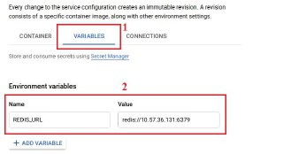
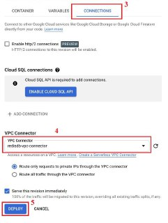

# Basic Redis Leaderboard Demo Java

Show how the redis works with Java, Spring.

## Try it out

<p>
    <a href="https://heroku.com/deploy" target="_blank">
        
    <a>
</p>

<p>
    <a href="https://deploy.cloud.run" target="_blank">
        
    </a>
    (See notes: How to run on Google Cloud)
</p>


## How to run on Google Cloud

<p>
    If you don't have redis yet, plug it in  (https://spring-gcp.saturnism.me/app-dev/cloud-services/cache/memorystore-redis).
    After successful deployment, you need to manually enable the vpc connector as shown in the pictures:
</p>

1. Open link google cloud console.


2. Click "Edit and deploy new revision" button.


3. Add environment.



4.  Select vpc-connector and deploy application.



<a href="https://github.com/GoogleCloudPlatform/cloud-run-button/issues/108#issuecomment-554572173">
Problem with unsupported flags when deploying google cloud run button
</a>

## How it works?


# How it works?
## 1. How the data is stored:
<ol>
    <li>The company data is stored in a hash like below:
      <pre>HSET "company:AAPL" symbol "AAPL" market_cap "2600000000000" country USA</pre>
     </li>
    <li>The Ranks are stored in a ZSET. 
      <pre>ZADD companyLeaderboard 2600000000000 company:AAPL</pre>
    </li>
</ol>

<br/>

## 2. How the data is accessed:
<ol>
    <li>Top 10 companies: <pre>ZREVRANGE companyLeaderboard 0 9 WITHSCORES</pre> </li>
    <li>All companies: <pre>ZREVRANGE companyLeaderboard 0 -1 WITHSCORES</pre> </li>
    <li>Bottom 10 companies: <pre>ZRANGE companyLeaderboard 0 9 WITHSCORES</pre></li>
    <li>Between rank 10 and 15: <pre>ZREVRANGE companyLeaderboard 9 14 WITHSCORES</pre></li>
    <li>Show ranks of AAPL, FB and TSLA: <pre>ZSCORE companyLeaderBoard company:AAPL company:FB company:TSLA</pre> </li>
    <!-- <li>Pagination: Show 1st 10 companies: <pre>ZSCAN 0 companyLeaderBoard COUNT 10 7.Pagination: Show next 10 companies: ZSCAN &lt;return value from the 1st 10 companies&gt; companyLeaderBoard COUNT 10 </li> -->
    <li>Adding market cap to companies: <pre>ZINCRBY companyLeaderBoard 1000000000 "company:FB"</pre></li>
    <li>Reducing market cap to companies: <pre>ZINCRBY companyLeaderBoard -1000000000 "company:FB"</pre></li>
    <li>Companies over a Trillion: <pre>ZCOUNT companyLeaderBoard 1000000000000 +inf</pre> </li>
    <li>Companies between 500 billion and 1 trillion: <pre>ZCOUNT companyLeaderBoard 500000000000 1000000000000</pre></li>
</ol>


## How to run it locally?

## Development

```
git clone 
```

### Run docker compose or install redis manually

Install docker (on mac: https://docs.docker.com/docker-for-mac/install/)

```sh
docker network create global
docker-compose up -d --build
```

#### If you install redis manually open src/main/resources/ folder and provide the values for environment variables in application.properties
    redis_url=

#### else  
    copy .env.example .env
    export $(cat .env | xargs)

#### Run backend

Install gradle (on mac: https://gradle.org/install/)


Install JDK (on mac: https://docs.oracle.com/javase/10/install/installation-jdk-and-jre-macos.htm)

``` sh
gradle wrapper
./gradlew build
./gradlew run
```

